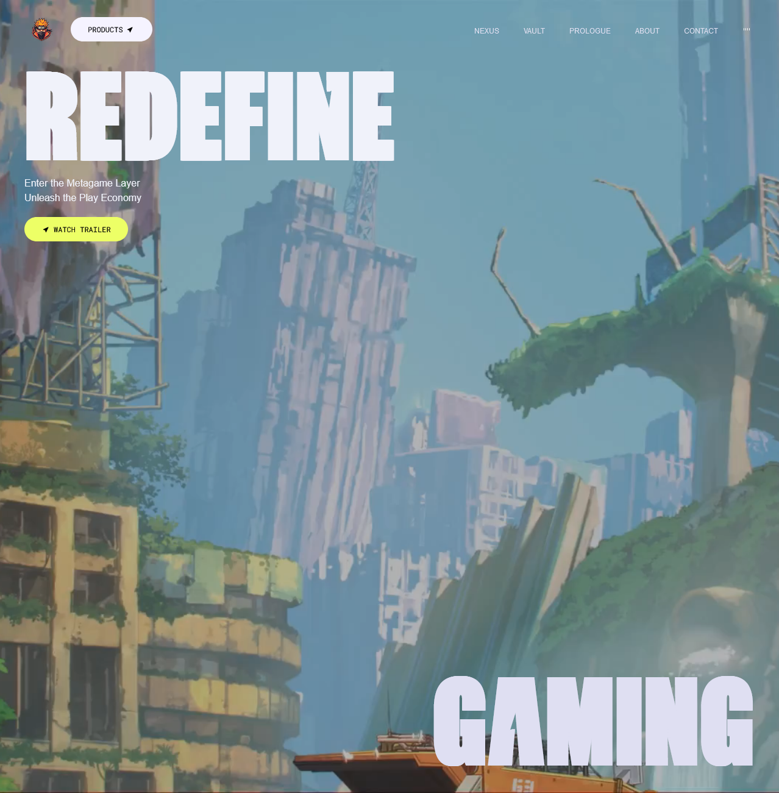

# React GSAP Magic 🎨✨

An advanced animation website built with **React**, **GSAP**, and **Tailwind CSS** to create stunning visual effects and seamless user interactions. This project showcases the power of modern web animation techniques with a focus on performance, responsiveness, and maintainable code architecture.

## 🌟 Introduction

Welcome to **React GSAP Magic**, where creativity meets functionality! This project is a perfect blend of **cutting-edge animations** and **smooth UI/UX**, designed to elevate user engagement and bring web elements to life. Whether you're scrolling through sections or interacting with 3D hover effects, this website guarantees a delightful experience.

> This project was created with the guidance of a **freeCodeCamp** tutorial, ensuring best practices and a strong foundation in modern web animation techniques.

## 🚀 Features

### 🎯 Scroll-Based Animations

Dynamic animations triggered by scrolling for a more engaging and interactive user experience.

### ✂️ Clip Path Shaped Animations

Unique geometric transitions using **CSS clip-paths**, creating visually stunning and modern effects.

### 🌀 3D Hover Effects

Interactive **3D transformations** that respond to user interactions, adding depth and modern flair.

### 🎥 Video Transitions

Seamlessly integrated **video elements** to enhance storytelling and maintain a smooth flow.

### 🧈 Smooth UI/UX

Polished interfaces with buttery-smooth interactions for an intuitive and enjoyable journey.

### 📱 Completely Responsive

Flawless adaptation across all devices, ensuring a consistent and optimized experience on desktops, tablets, and smartphones.

### 🛠️ Code Architecture & Reusability

Well-organized and reusable code components, making the project maintainable and scalable.

## 🖼️ Image and Video Section

- **Image Section**:  
  

- **Video Section**:  
  [Video Preview](./src/assets/videos/videoReadme.mp4)

## 📂 Project Dependencies

Here are the core dependencies used in this project:

```json
"dependencies": {
    "@gsap/react": "^2.1.1",
    "cra-template": "1.2.0",
    "gsap": "^3.12.5",
    "react": "^19.0.0",
    "react-dom": "^19.0.0",
    "react-icons": "^5.4.0",
    "react-scripts": "5.0.1",
    "react-use": "^17.6.0"
}
```

## 🌐 Live Demo & Source Code

- **Live Demo**: [React GSAP Magic](https://react-gsap-magic.vercel.app/)
- **Source Code**: [GitHub Repository](https://github.com/samirzjadhav/react-gsap-magic)

## 🛠️ Getting Started

1. Clone the repository:

   ```bash
   git clone https://github.com/samirzjadhav/react-gsap-magic.git
   ```

2. Navigate to the project directory:

   ```bash
   cd react-gsap-magic
   ```

3. Install dependencies:

   ```bash
   npm install
   ```

4. Start the development server:

   ```bash
   npm start
   ```

5. Open the project in your browser at:
   ```
   http://localhost:3000
   ```

## 📖 Learn More

- [GSAP Documentation](https://greensock.com/docs/)
- [Tailwind CSS Documentation](https://tailwindcss.com/docs)
- [React Documentation](https://reactjs.org/docs/)

## 👨‍💻 Author

Created with ❤️ by [Samir Z Jadhav](https://samirj.vercel.app/).

Feel free to star ⭐ the repository if you find this project helpful!

---

Enjoy building modern animations! 🚀
